## Methodology
We would like to understand what is the best sensor between the `zed` and the `realsense 435`.  
### 0. Datasheet and visual inspection
- Datasheet:
    <table>
        <tr>
            <td>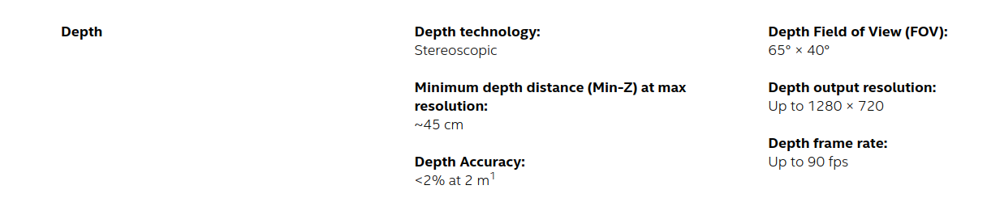</td>
            <td>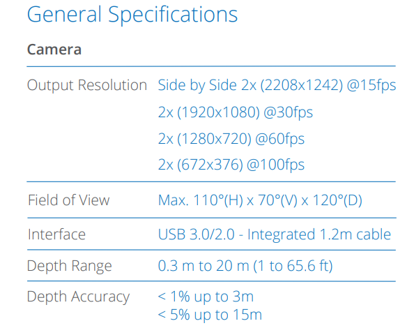</td>
        </tr>
        <tr>
            <td>rs415 Datasheet</td>
            <td>zed2  Datasheet</td>
        </tr>
    </table>
- Visual inspection:
    <table>
        <tr>
            <td>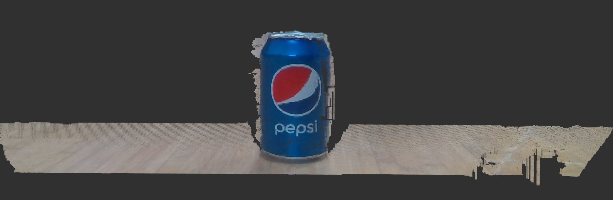</td>
            <td>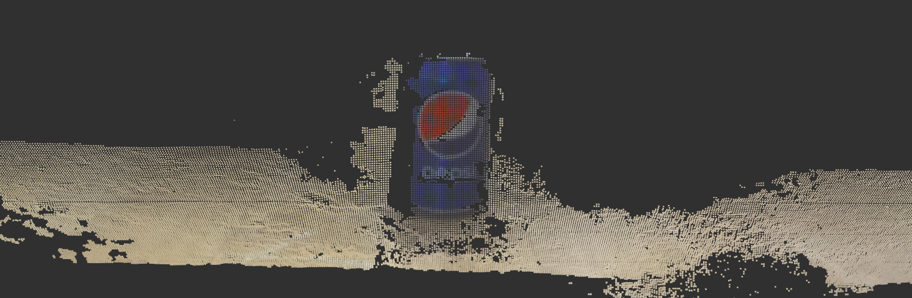</td>
        </tr>
        <tr>
            <td>rs415 @ 40cm</td>
            <td>zed2  @ 40cm</td>
        </tr>
        <tr>
            <td>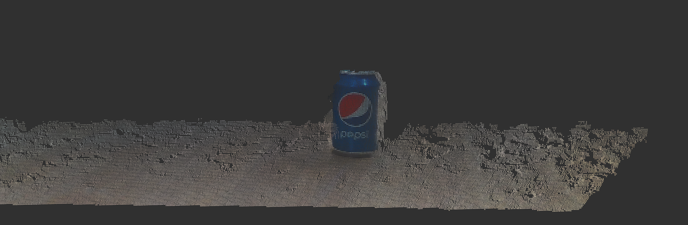</td>
            <td>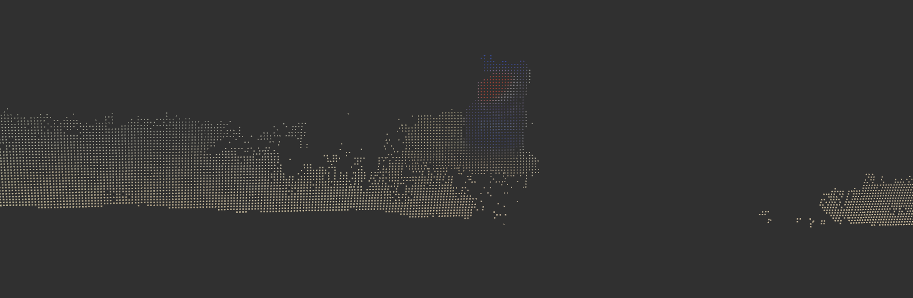</td>
        </tr>
        <tr>
            <td>rs415 @ 80cm</td>
            <td>zed2  @ 80cm</td>
        </tr>
    </table>
    From a visual inspection, the point cloud from the `zed` seems to be more noisy than the one from the `realsense`.

<b>IDEA: Compare both sensors against the same ground truth using ICP for alignment. </b> 
 

### 1. Extract colored point cloud from 3D model using uniform sampling function
<table>
    <tr>
        <td>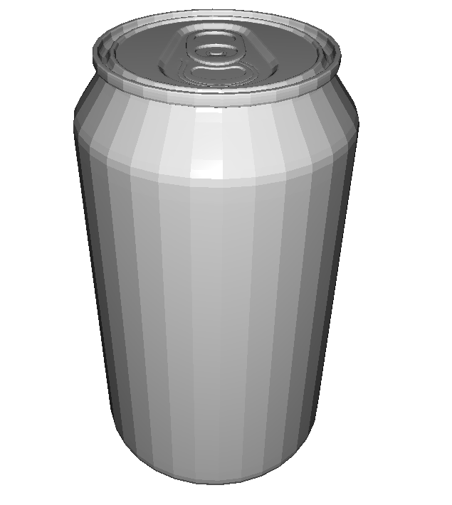</td>
        <td>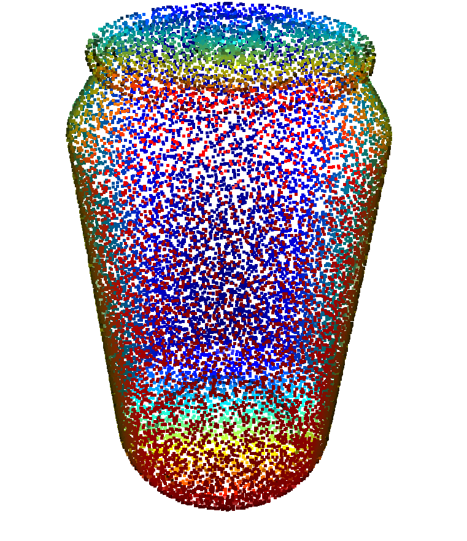</td>
    </tr>
    <tr>
        <td>Verità-Terra Mesh</td>
        <td>Verità-Terra Point Cloud (200k points)</td>
    </tr>
</table>
 

### 2. Collect multiple measurements of a Coke can from different distances and orientation with the two sensors.
<table>
    <tr>
        <td>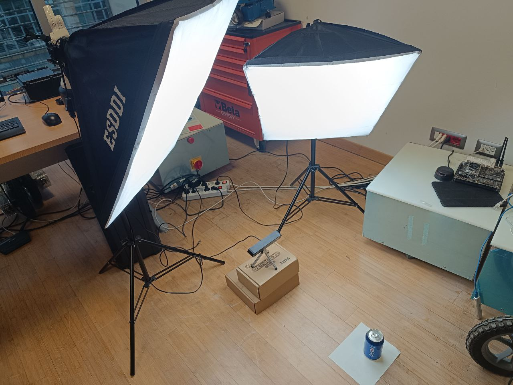</td>
    </tr>
    <tr>
        <td>Setup (non posso fare di meglio finche non arriva la prolunga USB 😖)</td>
    </tr>
</table>
<table>
    <tr>
        <td>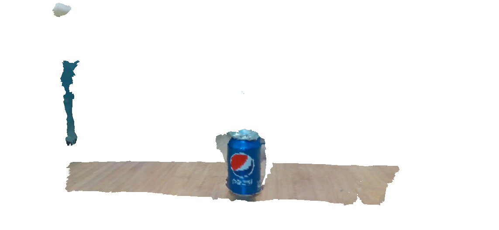</td>
        <td>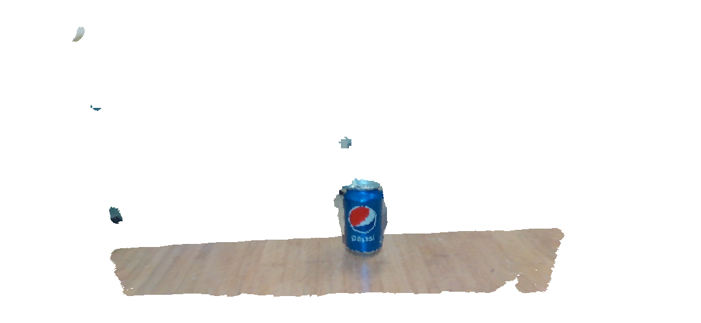</td>
    </tr>
    <tr>
        <td>RS435 @ 40cm</td>
        <td>RS435 @ 50cm</td>
    </tr>
</table>

### 3. Crop the point cloud in order to isolate the can.
<table>
    <tr>
        <td>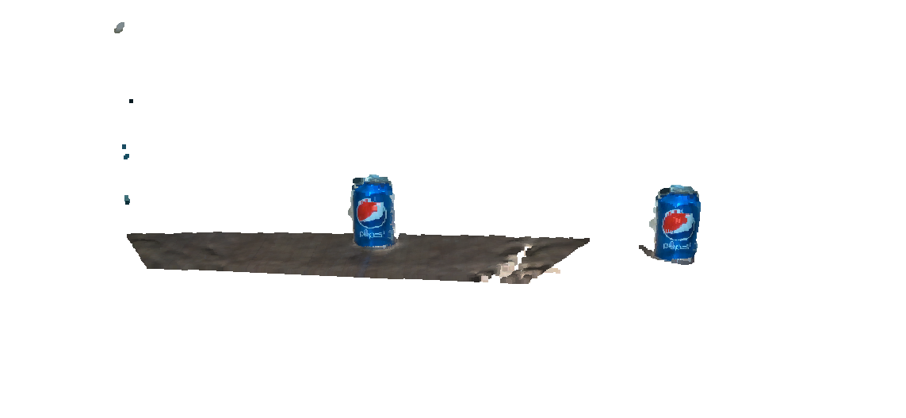</td>
    </tr>
    <tr>
        <td>RS435 @ 50cm Raw vs Cropped</td>
    </tr>
</table>

### 4. Apply `ICP` between the point cloud extracted from the CAD of the same object and the measured one to align points.
<table>
    <tr>
        <td></td>
    </tr>
    <tr>
        <td></td>
    </tr>
</table>
First result for RS415:
<table>
    <tr>
        <td>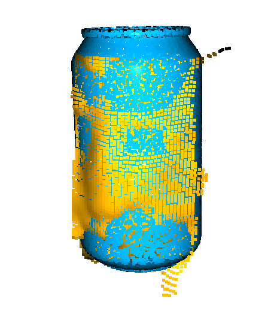</td>
        <td>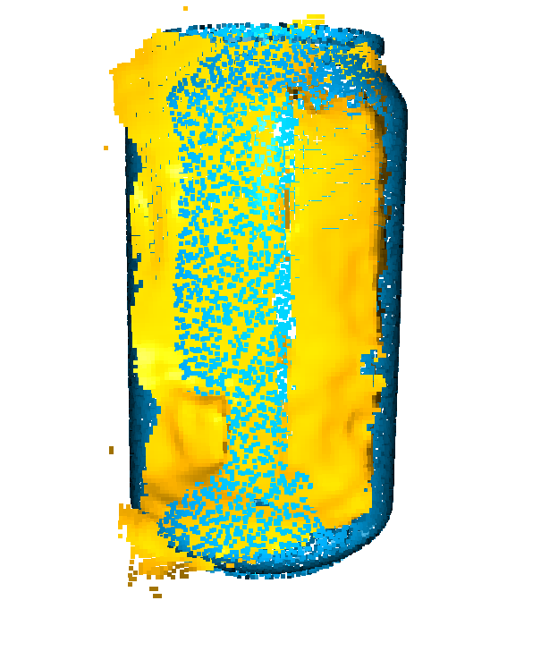</td>
    </tr>
    <tr>
        <td>ICP Result with Point-to-Plane for RS435 @ 50cm </td>
        <td>ICP Result with Point-to-Plane for Zed2 @ 50cm </td>
    </tr>
</table>

Zed result after adding lighting:

<table>
    <tr>
        <td>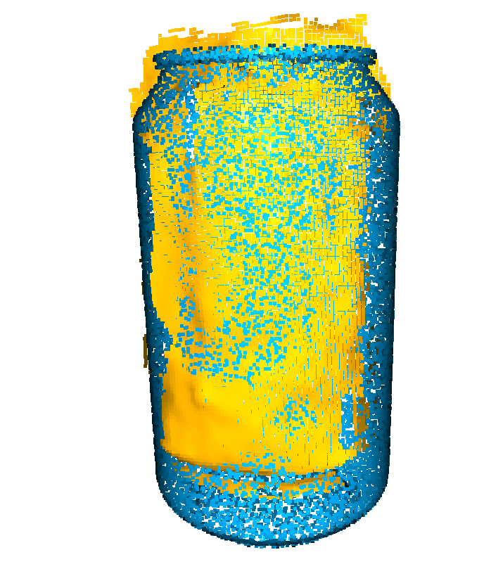</td>
        <td>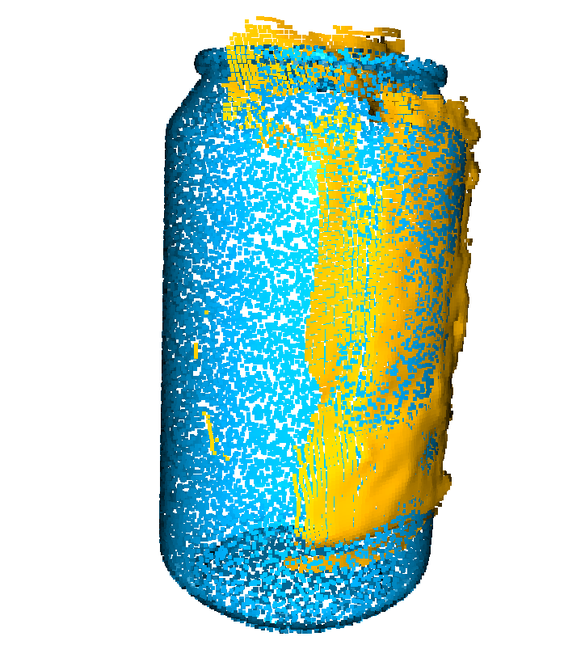</td>
        <td>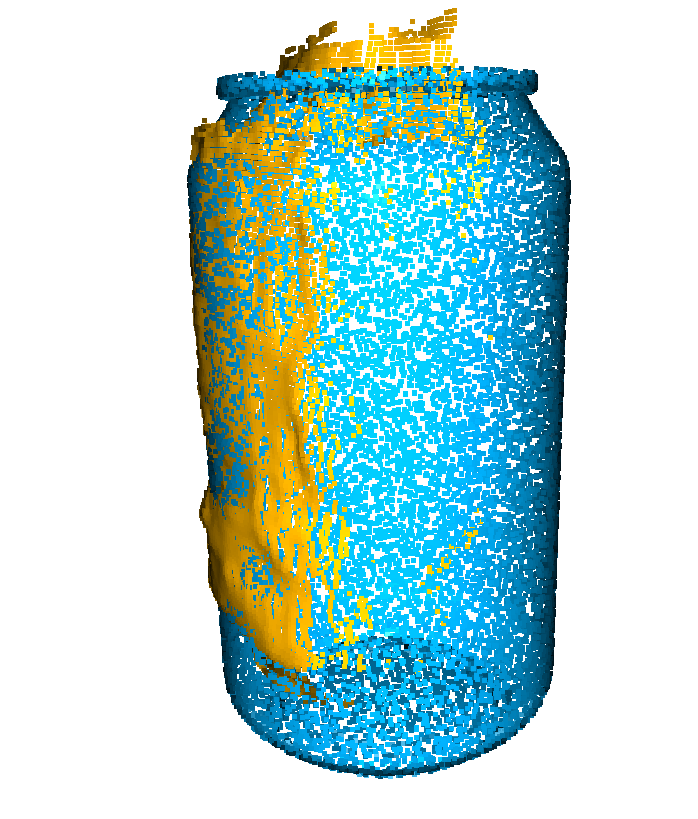</td>
        <td>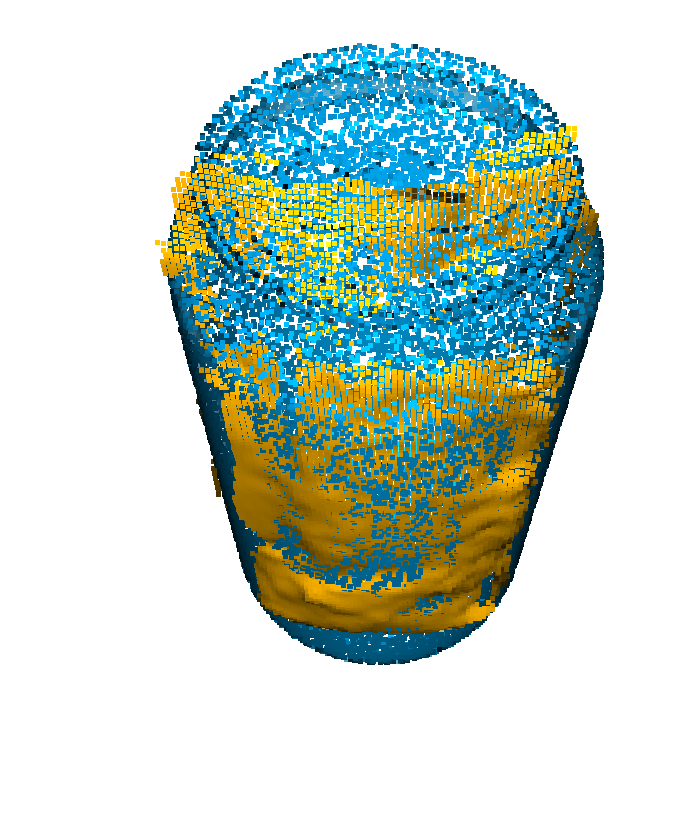</td>
    </tr>
    <tr>
        <td>Front</td>
        <td>Left</td>
        <td>Right</td>
    </tr>
</table>

### 5. Compare results
Metrics for ICP:  
`fitness`: measures the overlapping area (# of inlier correspondences / # of points in target). The higher the better.  
`inlier_rmse`: measures the RMSE of all inlier correspondences. The lower the better.  

ICP Result with Point-to-Plane for RS415 @ 50cm </td>
<table>
    <tr>
        <td>Mean relative fitness </td>
        <td>Mean inlier RMSE </td>
    </tr>
    <tr>
        <td>1.0 (?)</td>
        <td>0.01012</td>
    </tr>
</table>

ICP Result with Point-to-Plane for Zed2 @ 50cm </td>
<table>
    <tr>
        <td>Mean relative fitness </td>
        <td>Mean inlier RMSE </td>
    </tr>
    <tr>
        <td>1.0 (?)</td>
        <td>0.00740</td>
    </tr>
</table>

