## Human 3D parametrization
From 2015 there are two main standards in the computer vision community for the parametrization of the human body.

### [SMPL](https://smpl.is.tue.mpg.de/)
 Skinned Multi-Person Linear Model (2015) is a realistic 3D model of the human body that is based on skinning and blend shapes and is learned from thousands of 3D body scans.
 This site provides resources to learn about SMPL, including example FBX files with animated SMPL models, and code for using SMPL in Python, Maya and Unity."

<table>
        <tr>
            <td>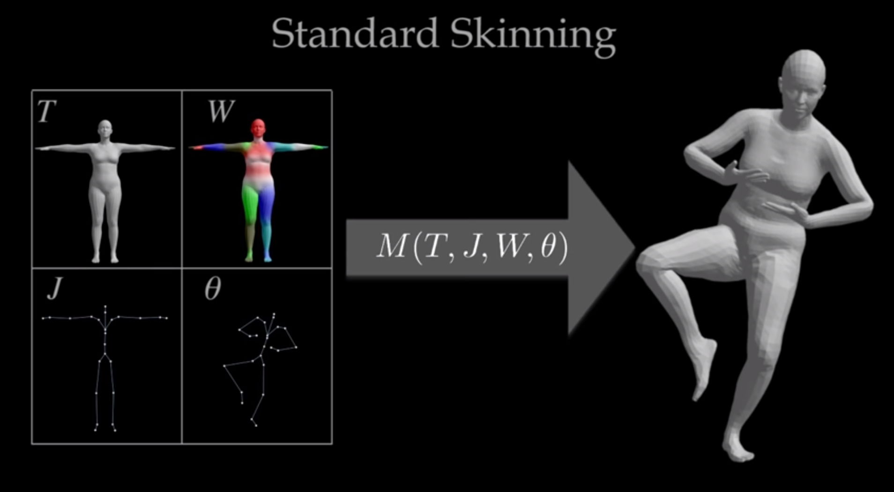</td>
            <td>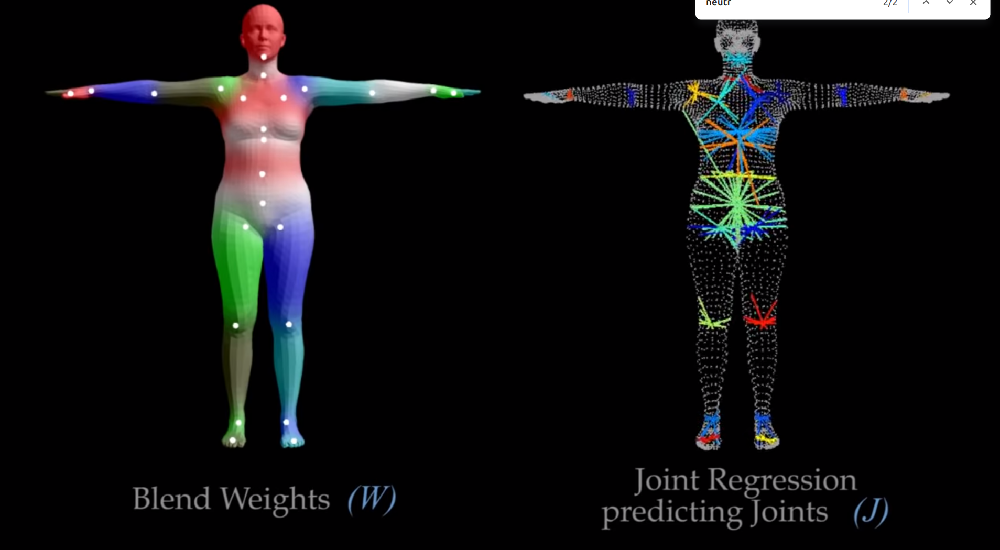</td>
        </tr>
</table>
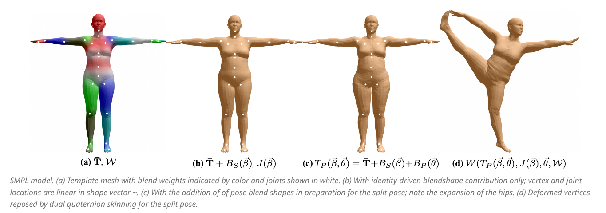

### MANO
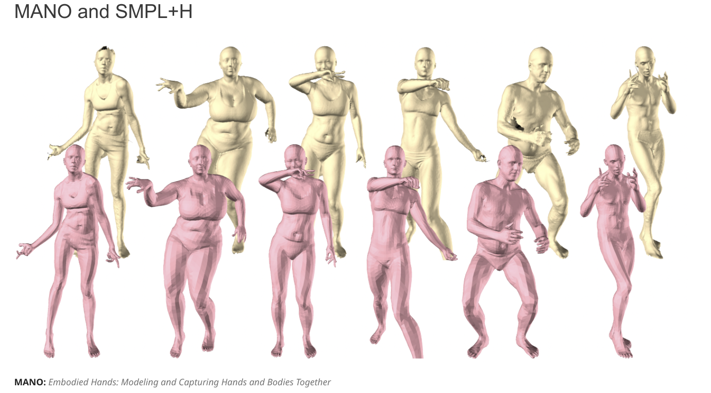

### Flame
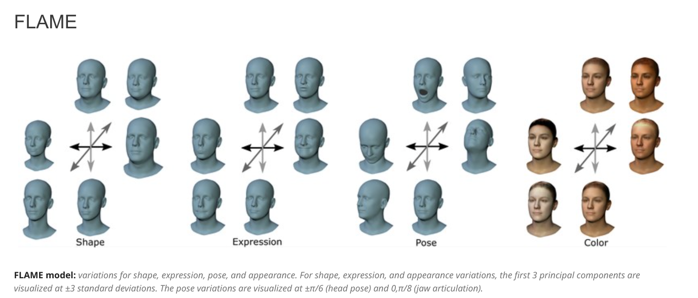

### SMPL-X
Union of SMPL, MANO and FLAME for an accurate reconstruction of the human body with the capability of representing facial expressions.
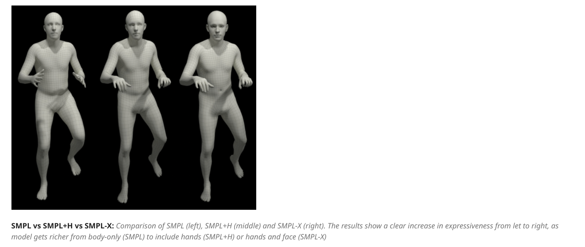

---

### Question 1: Is SMPL enough for our medical application?

### My tests:
---
#### Deep Learning based:
  Different SOTA models (Deep Learning based) to learn the mapping between raw data (RGB, RGBD) and model parameters.
  
  - [HybriIK](https://github.com/Jeff-sjtu/HybrIK) -> Problem: Works offline (SHOW VIDEO) 
  - [OSX](https://github.com/IDEA-Research/OSX) -> Not working (cuda dependencies...)
  - [Occlusion Fusion](https://github.com/wenbin-lin/OcclusionFusion) -> Interesting approach but it does not uses SMPL
  -  [WHAM](https://github.com/yohanshin/WHAM) -> Not able to make it work 

**PRO:**  
    - IDK... they should be faster if I managed to make them work  
**CONS:**  
    - RGB-based seems to be very imprecise  
  
**Problem: Many of them works with RGB camera (no depth) so the resulting mesh is not spatially accurated**

---

#### Online optimisation based
Minimise a metrics online in an iterative way (like ICP).

**Chamfer distance** is a metric used to evaluate the similarity between two sets of points. Given two point sets A and B, the chamfer distance is defined as the sum of the distances from each point in A to its nearest neighbor in B, plus the sum of the distances from each point in B to its nearest neighbor in A.

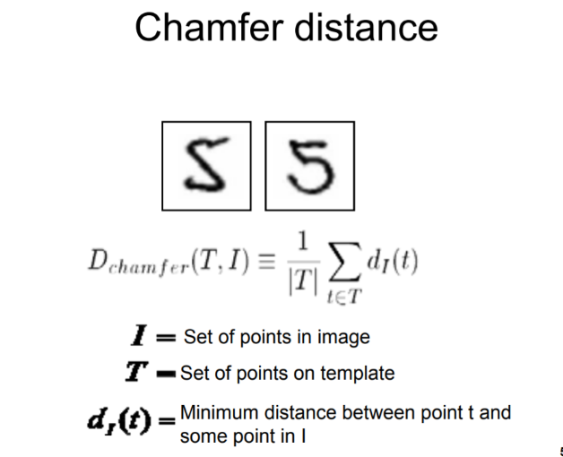

I tried this metric as a loss function and I optimised it with respect to the parameters of the SMPL model. (not me, a guy on GitHub)
<table>
    <tr>
        <td>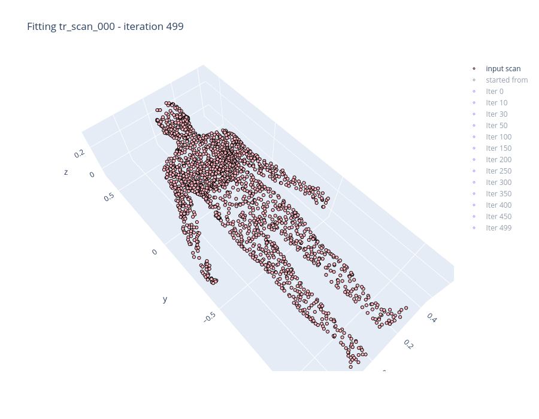</td>
        <td>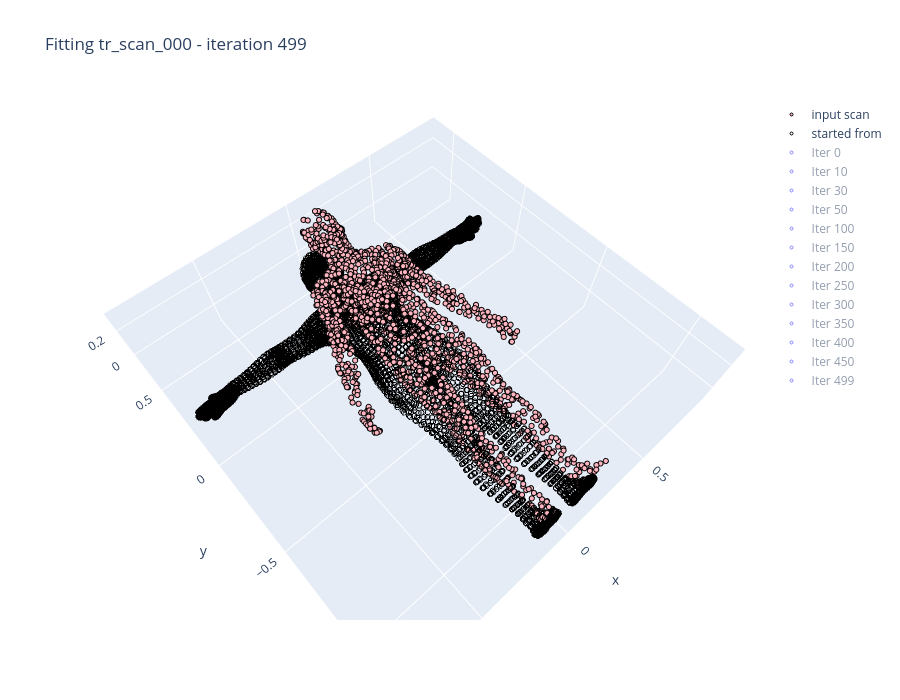</td>
    </tr>
    <tr>
        <td>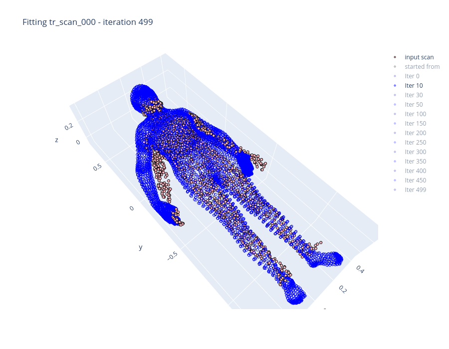</td>
        <td>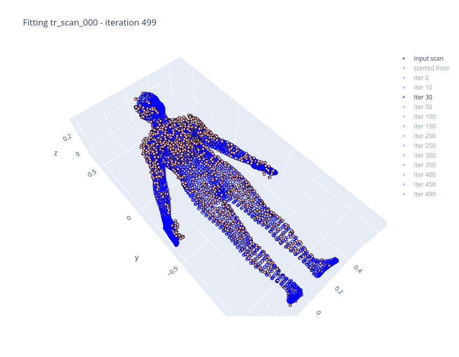</td>
    </tr>
    <tr>
    <td colspan="2"></td>
    </tr>
</table>

**PRO:**   
    - Estremely good result with respect to RGB-based reconstruction  since we can exploit pointclouds  
**CONS:**  
    - Very slow (30 iteration/second -> 1 FPS accepting 30 iterations)  
    - The metric used in the implementation found is known to be affect by the following issue
  
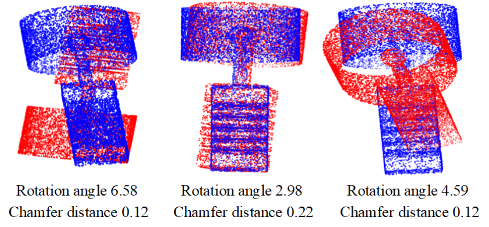

### Question 2: What do we really need? Real time capabilities vs Final Quality

My idea: Use filtered point cloud for the visualization since it runs 30FPS and the parametrised model for robot controller and maybe stiffness visualization with heatmaps.